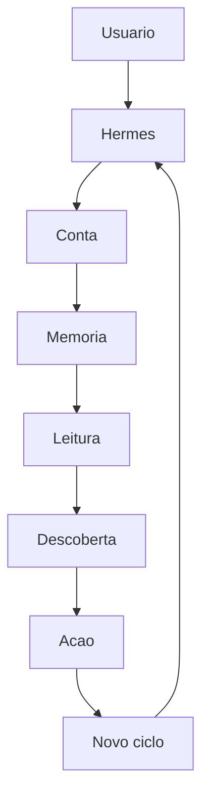
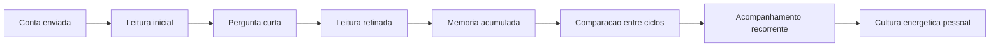

# Product Flow 2030

## Fluxo central

## Leitura do fluxo

### 1. Usuario

Tudo comeca com uma pessoa que quer entender melhor sua energia, mesmo que ainda nao saiba formular essa necessidade com precisao.

### 2. Hermes

Hermes abre o contato, acompanha e conduz a relacao.
Ele recebe, pergunta quando necessario e retorna quando existe algo novo que merece atencao.

### 3. Conta

A conta e a materia-prima.
Ela nao e o produto final.
Ela e o ponto de entrada para uma leitura mais profunda da residencia.

### 4. Memoria

A memoria conecta ciclos.
Ela impede que cada leitura pareca um recomeco.
Ela acumula contexto util sem inventar verdade.

### 5. Leitura

A leitura organiza o que a Score conseguiu compreender.
Ela transforma dados em entendimento inicial.

### 6. Descoberta

A descoberta seleciona o que mais importa agora.
Ela da protagonismo a uma unica conclusao util por vez.

### 7. Acao

Toda descoberta deve terminar em orientacao.
A acao nao precisa ser grande.
Ela precisa ser clara.

### 8. Novo ciclo

O novo ciclo nao reinicia a experiencia.
Ele amplia a relacao entre usuario, casa e energia.

## Fluxo de longo prazo

## O que esse fluxo significa

No curto prazo, a Score traduz uma conta.
No medio prazo, ela acompanha uma casa.
No longo prazo, ela ajuda a formar cultura energetica.

Esse e o fluxo que orienta o produto em 2030:

- menos coleta;
- mais leitura;
- menos ruido;
- mais continuidade;
- menos sistema;
- mais percepcao de inteligencia.
