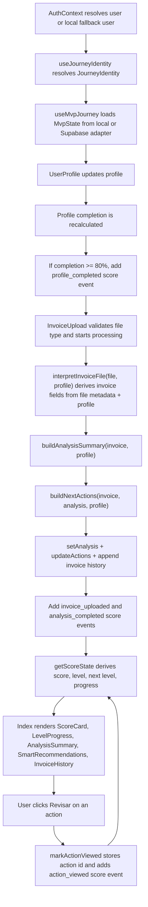

# Score Energy Verse

This repo is a Vite + React + TypeScript app whose current MVP is centered on a single persisted journey state per user. The main product flow lives in `/perfil`, where the user completes a profile, uploads an energy bill file, receives a deterministic analysis summary, accumulates score events, and unlocks next actions plus ranking visibility.

## Product Documentation

- [Product Vision](docs/product/PRODUCT_VISION.md)
- [Consultive Engine](docs/product/CONSULTIVE_ENGINE.md)
- [Roadmap](docs/product/ROADMAP.md)

## Routes that exist today

- `/`: static marketing landing page from `src/pages/LandingPage.tsx`
- `/login`: login form backed by `AuthContext`
- `/registro`: registration form backed by `AuthContext`
- `/perfil`: protected MVP journey page in `src/pages/Index.tsx`
- `/ranking`: protected leaderboard page in `src/pages/Ranking.tsx`
- `*`: not found page

## Real runtime architecture

### App shell

- `src/main.tsx`: boots React and global CSS
- `src/App.tsx`: wraps the app with `QueryClientProvider`, `AuthProvider`, tooltip/toast providers, `BrowserRouter`, global `Header`, and global `Footer`
- `ProtectedRoute` in `src/App.tsx`: blocks `/perfil` and `/ranking` until auth loading finishes and a user exists

`@tanstack/react-query` is configured at the app root, but the current MVP journey itself is not implemented with query hooks. The journey and ranking pages use custom hooks with `useEffect`, `useState`, and `useMemo`.

### Pages and the components they actually compose

- `src/pages/Index.tsx`
  - Reads all journey data and mutations from `useMvpJourney()`
  - Renders the current flow with:
    - `UserProfile`
    - `MascotCustomization`
    - `InvoiceUpload`
    - `AnalysisSummary`
    - `MascotGuidanceCard`
    - `ScoreCard`
    - `LevelProgress`
    - `SmartRecommendations`
    - `InvoiceHistory`
  - Also renders a local score event feed from `scoreEvents`

- `src/pages/Ranking.tsx`
  - Reads leaderboard data from `useRanking()`
  - Renders `Leaderboard`
  - Shows the current user position, current source label, and an implementation limitation string when provided by the service

- `src/pages/Login.tsx` and `src/pages/Register.tsx`
  - Call `signIn` and `signUp` from `AuthContext`
  - Redirect to `/perfil` after successful login

- `src/pages/LandingPage.tsx`
  - Static marketing page with rotating hero, benefits, testimonials, news, team, partners, and CTA sections
  - It does not read MVP journey state

### Hooks

- `src/hooks/useMvpJourney.ts`
  - Main orchestration hook for the `/perfil` page
  - Resolves identity through `useJourneyIdentity()`
  - Loads state from the configured journey service
  - Saves the whole journey state back through the same service after local state changes
  - Exposes the mutations used by the page:
    - `updateProfile`
    - `updateMascotCustomization`
    - `startInvoiceProcessing`
    - `completeInvoiceFlow`
    - `removeInvoiceFromHistory`
    - `markActionViewed`

- `src/hooks/useJourneyIdentity.ts`
  - Converts auth state into a stable `journeyIdentity` used by persistence and ranking services

- `src/hooks/useRanking.ts`
  - Loads ranking entries through the active ranking service
  - Computes `currentUserEntry`

- `src/hooks/useInvoices.ts`
  - Separate invoice CRUD hook against `public.invoices` plus optional Supabase Storage upload
  - Exists in the repo, but is not wired into `/perfil`

### Core libs

- `src/lib/mvpCoreFlow.ts`
  - Pure domain logic for the MVP
  - Calculates:
    - profile completion
    - invoice interpretation
    - analysis summary
    - next actions
    - mascot guidance
    - score event creation
    - score, level, and progress

- `src/lib/mvpJourneyState.ts`
  - Defines defaults and normalization
  - Updates profile, mascot, analysis, actions, and score events
  - Resolves `journeyStage`, including `return-visit` after 30 minutes of inactivity when prior analysis exists

- `src/lib/mvpPersistence.ts`
  - Local storage persistence adapter used by the local service
  - Migrates from an older legacy storage key into the current `MvpState` shape

- `src/lib/journeyIdentity.ts`
  - Maps authenticated users, local auth fallback users, or a generated development identity into a `JourneyIdentity`

- `src/lib/supabase.ts`
  - Shared Supabase client for auth and the older invoice hook

### Service layer and adapters

#### MVP journey service

- Contracts: `src/services/mvpJourney/contracts.ts`
- Provider resolution: `src/services/mvpJourney/index.ts`
- Local adapter: `src/services/mvpJourney/localAdapter.ts`
- Supabase adapter: `src/services/mvpJourney/supabaseAdapter.ts`
- Supabase client validation: `src/services/mvpJourney/supabaseClient.ts`

The journey service uses a provider switch:

- default provider: `local`
- Supabase provider: selected only when `VITE_MVP_JOURNEY_PROVIDER=supabase`

The adapters implement the same contract:

- `loadJourneyState`
- `saveJourneyState`
- `saveProfile`
- `saveMascot`
- `saveAnalysis`
- `appendScoreEvent`
- `saveActions`

In practice, `useMvpJourney()` currently loads once and then persists the whole `MvpState` on every local state change through `saveJourneyState`.

#### Ranking service

- Contracts: `src/services/ranking/contracts.ts`
- Provider resolution: `src/services/ranking/index.ts`
- Helpers: `src/services/ranking/helpers.ts`
- Local adapter: `src/services/ranking/localAdapter.ts`
- Supabase adapter: `src/services/ranking/supabaseAdapter.ts`

The ranking provider follows the active MVP journey provider:

- local journey provider -> local ranking service
- Supabase journey provider -> Supabase ranking service

## State model that drives the MVP

The entire flow is built around `MvpState` in `src/types/mvp.ts`:

- `profile`
  - `consumerType`
  - `location`
  - `propertySize`
  - `peopleCount`
  - `energyPreference`

- `mascot`
  - `name`
  - `emoji`
  - `colorPalette`
  - `borderEffect`

- `analysis`
  - `status`: `idle | processing | ready`
  - `latestInvoice`
  - `invoiceHistory`
  - `summary`
  - `lastCompletedAt`

- `scoreEvents`
  - array of explicit event records

- `actions`
  - `items`
  - `viewedActionIds`
  - `lastUpdatedAt`

- `journeyStage`
  - `onboarding`
  - `before-upload`
  - `invoice-uploaded`
  - `analysis-ready`
  - `return-visit`

- `lastActiveAt`

## Actual MVP journey data flow



### Profile -> invoice -> analysis -> score -> actions, in concrete terms

#### 1. Profile

`UserProfile` edits the five profile fields. `useMvpJourney.updateProfile()` normalizes them through `mvpJourneyState.updateProfile()` and then checks completeness with `getProfileCompletion()`.

Profile completion is based on five checks:

- consumer type exists
- location is non-empty
- property size is greater than zero
- people count is greater than zero
- energy preference exists

`isProfileComplete()` becomes true at `>= 80%`, which means at least four of the five checks pass.

When the profile first reaches that threshold, `useMvpJourney` adds a `profile_completed` event worth `80` points. The score event id is fixed as `profile-completed`, so the same completion event is not re-added repeatedly.

#### 2. Invoice

`InvoiceUpload` accepts only:

- `application/pdf`
- `image/jpeg`
- `image/png`
- `image/jpg`

On upload it:

- sets local uploading UI state
- calls `onUploadStarted()` -> `startInvoiceProcessing()` -> analysis status becomes `processing`
- waits `1200ms`
- calls `interpretInvoiceFile(file, profile)`
- passes the original `File` into `completeInvoiceFlow(file)`

Important implementation detail: the current MVP does not parse real invoice contents. `interpretInvoiceFile()` derives invoice values deterministically from:

- file name
- file size
- file lastModified
- file type
- profile consumer type
- profile location
- property size
- people count
- energy preference

The generated invoice contains:

- `fingerprint`
- `fileName`
- `fileType`
- `fileSize`
- `consumption`
- `totalValue`
- `taxPercentage`
- `peakHours`
- `month`
- `uploadedAt`

#### 3. Analysis

`completeInvoiceFlow()` calls `buildAnalysisSummary(invoice, profile)`.

That summary is derived from:

- consumer-specific consumption thresholds
- a cost signal from total value
- a small rule override when energy preference is `Solar` and cost is not `controlado`

The resulting analysis state contains:

- `consumptionLevel`: `baixo | moderado | alto`
- `costSignal`: `controlado | atencao | elevado`
- `headline`
- two `observations`
- `whatMattersNext`
- `efficiencyLabel`

The journey state is then updated with:

- `analysis.latestInvoice`
- `analysis.invoiceHistory`
- `analysis.summary`
- `analysis.status = ready`
- `analysis.lastCompletedAt`
- `journeyStage = analysis-ready`

#### 4. Score

Score is never stored as a top-level numeric field. It is always derived from `scoreEvents` through `getScoreState()`.

Current score events and points:

- `profile_completed`: `80`
- `invoice_uploaded`: `120`
- `analysis_completed`: `100`
- `action_viewed`: `30`

Current level logic:

- `level = max(1, floor(score / 200) + 1)`
- `nextLevelScore = level * 200`
- progress is the percentage between the current level floor and the next level threshold

`completeInvoiceFlow()` adds two fingerprint-based score events:

- `invoice-uploaded:{invoice.fingerprint}`
- `analysis-completed:{invoice.fingerprint}`

`markActionViewed()` adds one action-based score event:

- `action-viewed:{action.id}`

Because score events are deduplicated by id, the same invoice or the same action review does not keep increasing the score repeatedly.

#### 5. Actions

`buildNextActions(invoice, analysis, profile)` runs after analysis and writes into `state.actions`.

Action generation is rule-based:

- no invoice or no analysis
  - one high-priority action is returned:
    - `Completar o perfil`, or
    - `Enviar a primeira fatura` when the profile is already complete

- `analysis.consumptionLevel === "alto"`
  - adds `map-peak-usage`

- `analysis.costSignal !== "controlado"`
  - adds `choose-one-cost-cut`

- `profile.energyPreference === "Solar" || "Hibrido"`
  - adds `record-demand-pattern`

- if fewer than three actions exist
  - adds `return-next-bill`

`SmartRecommendations` renders these actions and calls `markActionViewed(action)` when the user clicks `Revisar`.

### What happens when an invoice is removed

`removeInvoiceFromHistory(fingerprint)` does not just delete a row from the UI.

It recalculates state like this:

- if no invoice remains
  - clears `latestInvoice`
  - clears `summary`
  - resets analysis status to `idle`
  - rebuilds next actions for the no-invoice case
  - sets stage to `before-upload` when the profile is complete, otherwise `onboarding`

- if invoices remain
  - picks the newest remaining invoice
  - rebuilds the fallback analysis
  - rebuilds fallback actions
  - keeps only viewed action ids that still exist in the recalculated action list
  - sets stage back to `analysis-ready`

## How Supabase is actually used

### 1. Auth

`src/contexts/AuthContext.tsx` uses Supabase auth only when `src/lib/supabase.ts` can create a client from:

- `VITE_SUPABASE_URL`
- `VITE_SUPABASE_ANON_KEY`

When Supabase is configured, auth uses:

- `supabase.auth.getSession()`
- `supabase.auth.onAuthStateChange()`
- `supabase.auth.signInWithPassword()`
- `supabase.auth.signUp()`
- `supabase.auth.signOut()`

When Supabase is not configured, `AuthContext` falls back to local browser auth using two localStorage keys:

- `score-energy-local-auth-account`
- `score-energy-local-auth-session`

In local mode, the app creates a mock `User` object so the protected routes and journey flow still work.

### 2. MVP journey persistence

The current Supabase-backed journey does not write separate profile, invoice, analysis, or actions tables. It writes one normalized JSON state blob to `public.mvp_journey_state`.

`src/services/mvpJourney/supabaseAdapter.ts`:

- loads the latest row for the current `user_id`
- reads `id, user_id, state, updated_at, created_at`
- normalizes the JSON payload into `MvpState`
- updates or inserts a single row per user
- writes `lastActiveAt` on every save

The adapter is cautious about secure mode:

- if the app is using a local fallback identity, it warns that RLS based on `auth.uid()` will block access
- if no valid user id exists, it returns the default local state instead of inventing an id

`src/services/mvpJourney/supabaseClient.ts` only creates the journey client when:

- the URL exists
- the anon key exists
- the URL is a project root URL, not a `/rest/v1/` URL
- the anon key starts with `sb_publishable_`

### 3. Supabase RLS and read model migrations

The repo contains these active journey/ranking migrations:

- `supabase/migrations/20260422_mvp_journey_state_rls.sql`
  - enables and forces RLS on `public.mvp_journey_state`
  - allows authenticated users to select/insert/update only rows where `auth.uid()::text = user_id`

- `supabase/migrations/20260422_ranking_entries_shared_read_model.sql`
  - creates `public.ranking_entries`
  - exposes only:
    - `user_id`
    - `display_name`
    - `score`
    - `level`
    - `consumer_type`
    - `updated_at`
  - enables RLS
  - allows authenticated users to read the leaderboard
  - allows authenticated users to insert/update only their own `user_id`

The SQL migration also backfills `ranking_entries` from the latest `mvp_journey_state` rows by summing `scoreEvents[*].points` and deriving `level` as `floor(score / 200) + 1`.

### 4. Ranking synchronization

When the Supabase journey adapter successfully persists a journey state, it immediately calls `syncSupabaseRankingEntry()` from `src/services/ranking/supabaseAdapter.ts`.

That sync:

- derives a `RankingSnapshot` from the just-saved `MvpState`
- skips sync when the user has no score events
- upserts one row into `public.ranking_entries`

No private journey JSON is exposed in the leaderboard query path.

### 5. Older invoice table path that still exists in the repo

This repo also contains a different invoice persistence path:

- `src/hooks/useInvoices.ts`
- `supabase_migration.sql`
- `src/components/SupabaseTest.tsx`

That path uses:

- `public.invoices`
- optional Supabase Storage bucket `invoices`

But the main `/perfil` MVP flow does not currently use that hook. The active MVP journey uses `MvpState.analysis.invoiceHistory` inside the unified journey state instead.

## How ranking works right now

### Shared shape

All ranking entries use the same derived fields:

- `userId`
- `position`
- `displayName`
- `subtitle`
- `score`
- `level`
- `badgeLabel`
- `updatedAt`
- `isCurrentUser`

The current user is relabeled from their public display name to `Voce` in the rendered ranking entry.

### Display name derivation

`buildPublicRankingDisplayName()` in `src/services/ranking/helpers.ts` uses:

- `{consumerType} em {location}` when location exists
- otherwise `Usuario {first 6 chars of userId}`

The subtitle is:

- `{consumerType} - {location}` when location exists
- otherwise just `{consumerType}`

### Sorting and positions

`rankEntries()` sorts by:

1. higher score first
2. more recent `updatedAt` first
3. alphabetical `displayName`

Position is then assigned as `index + 1`.

### Local ranking mode

When the active journey provider is local, `createLocalRankingService()`:

- scans localStorage for keys under `score-energy:mvp-journey:v1:*`
- loads each stored `MvpState`
- derives one ranking entry per stored user state
- returns `scope: "shared"` with source label `Dados reais visiveis neste navegador`

This means the local leaderboard is shared only across journeys stored in the same browser storage, not across users in a remote backend.

### Supabase ranking mode

When the active journey provider is Supabase, `createSupabaseRankingService()`:

- reads `public.ranking_entries`
- filters to `score > 0`
- orders by score desc and updated_at desc
- rebuilds ranking positions on the client

The service currently returns a limitation string:

`As linhas do ranking ainda sao derivadas no cliente a partir da propria jornada do usuario. A leitura compartilhada ja existe, mas a derivacao ainda nao e validada por um backend dedicado.`

## Local development

### Scripts

```bash
npm run dev
npm run build
npm run build:dev
npm run lint
npm run preview
```

### Environment variables used by the current code

```env
VITE_SUPABASE_URL=
VITE_SUPABASE_ANON_KEY=
VITE_MVP_JOURNEY_PROVIDER=local
```

Notes:

- `local` is the default provider
- set `VITE_MVP_JOURNEY_PROVIDER=supabase` only when the browser client is correctly configured
- without Supabase, the app still works through local auth fallback + local MVP journey persistence

## Current implementation boundaries visible in code

- Invoice analysis is deterministic and based on file metadata plus profile context. There is no OCR or real invoice extraction in the active `/perfil` flow.
- Score is derived only from explicit score events, not from direct invoice totals.
- The main MVP stores journey data as a single state object, not as separate normalized domain tables.
- The leaderboard only includes users with at least one score event.
- The landing page contains static marketing content and does not connect to journey state.
